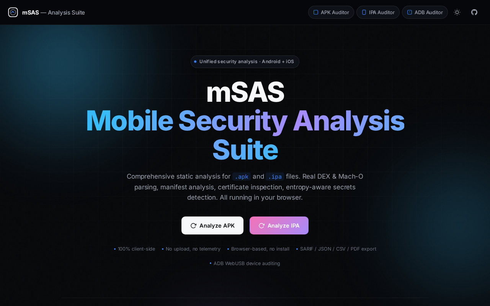

<div align="center">
  <br/>
  
  <br/>
  <h1>🛡️ mSAS</h1>
  <h3>Mobile Security Analysis Suite</h3>
  <p><strong>Browser-based · Zero uploads · 230+ OWASP-aligned security rules</strong></p>

  <!-- Emerald-themed badges -->
  <p>
    <a href="https://github.com/mravtechinfo/mobile-pentest-suite/actions">
      
    </a>
    
    
    <a href="https://msas-au8.pages.dev">
      
    </a>
  </p>

  <!-- Quick badges row -->
  <p>
    
    
    
    
    
    
  </p>

  <br/>

  <!-- Metrics row -->
  <table>
    <tr>
      <td width="200" align="center"><br/><strong>230+</strong><br/><span>Security Rules</span><br/><br/></td>
      <td width="200" align="center"><br/><strong>3</strong><br/><span>Analysis Tools</span><br/><br/></td>
      <td width="200" align="center"><br/><strong>5</strong><br/><span>Export Formats</span><br/><br/></td>
      <td width="200" align="center"><br/><strong>231</strong><br/><span>Unit Tests</span><br/><br/></td>
      <td width="200" align="center"><br/><strong>100%</strong><br/><span>Client-Side</span><br/><br/></td>
    </tr>
  </table>
</div>

<br/>

---

<div align="center">
  
  <br/>
  <em>mSAS Landing Page — Drag-and-drop APK/IPA analysis in your browser</em>
</div>

<br/>

## ✨ What is mSAS?

**mSAS** is a comprehensive, browser-based mobile security analysis suite. It analyzes **Android APKs**, **iOS IPA files**, and audits **live Android devices** — all **100% client-side with zero data uploads**.

No installation. No server. No telemetry. Just drag, drop, and discover.

> [!IMPORTANT]
> Every analysis runs inside a **Web Worker** in your browser. Files **never leave your machine**. You can disconnect from the internet after the page loads — the analysis works entirely offline.

---

## 🎯 The Three Tools

<div align="center">
  <table>
    <tr>
      <td width="33%" align="center">
        <br/>
        <h3>📱 APK Auditor</h3>
        <p><em>Android Static Analysis</em></p>
        <br/>
        <a href="https://msas-au8.pages.dev/apk-auditor/">
          
        </a>
        <br/><br/>
      </td>
      <td width="33%" align="center">
        <br/>
        <h3>🍎 IPA Auditor</h3>
        <p><em>iOS Static Analysis</em></p>
        <br/>
        <a href="https://msas-au8.pages.dev/ipa-auditor/">
          
        </a>
        <br/><br/>
      </td>
      <td width="33%" align="center">
        <br/>
        <h3>🤖 ADB Auditor</h3>
        <p><em>Live Device Auditing</em></p>
        <br/>
        <a href="https://msas-au8.pages.dev/adb-auditor/">
          
        </a>
        <br/><br/>
      </td>
    </tr>
  </table>
</div>

---

## 🔬 Capabilities

<details>
<summary><strong>📱 APK Auditor — 150+ Rules</strong></summary>
<br/>

| Category | What It Detects |
|----------|----------------|
| 🔐 **Cryptography** | Weak ciphers, custom crypto, hardcoded keys, insecure RNG, certificate validation flaws |
| 🗄️ **Storage & Data** | Insecure shared prefs, SQLite databases, clipboard logging, screenshot protection, NSUserDefaults, cache, backups |
| 🌐 **Network & Platform** | Cleartext traffic, TLS misconfiguration, WebView CVEs, deeplink hijacking, tapjacking, pending intents, content providers |
| 💻 **Code Quality** | ProGuard/obfuscation status, debug symbols, NDK libraries, deserialization risks, insecure update mechanisms |
| 🚀 **AI/ML Security** | Model extraction risks, AI API key exposure, prompt injection, SDK data collection, adversarial input handling |
| 🔄 **Resilience** | Root detection, anti-debugging, integrity checks, emulator detection, jailbreak detection |
| ⚡ **v2 Features** | Entropy-based secret scanner, SARIF 2.1 export, batch analysis |

</details>

<details>
<summary><strong>🍎 IPA Auditor — 80+ Rules</strong></summary>
<br/>

| Category | What It Detects |
|----------|----------------|
| 🏗️ **Mach-O Binary** | Full binary analysis — PIE, stack canary, ARC, code signing, NX heap/stack, FairPlay encryption |
| 📋 **Plist Analysis** | `Info.plist` parsing, privacy manifest inspection, URL schemes, bundle configuration |
| 🔐 **Provisioning** | Profile parsing, certificate chain validation, expiration, distribution type, team identifiers |
| 🌐 **ATS Audit** | App Transport Security deep-dive — arbitrary loads, exception domains, TLS version, PFS, certificate pinning |
| 📜 **Entitlements** | Risk assessment for get-task-allow, sandbox bypass, network extensions, VPN, keychain access |
| 🕵️ **Trackers** | SDK detection, analytics frameworks, ad networks, crash reporters |
| 🔎 **Entropy Scan** | Hardcoded secrets, API keys, tokens, credentials via Shannon entropy analysis |

</details>

<details>
<summary><strong>🤖 ADB Auditor — Live Device Security</strong></summary>
<br/>

| Feature | Description |
|---------|-------------|
| 🔌 **WebUSB + ADB** | Connect live Android devices directly from the browser |
| 📂 **File Browser** | Browse device filesystem with root support |
| 🐚 **Shell Access** | Run shell commands in real-time |
| 📸 **Screenshots** | Capture device screen from browser |
| 📋 **Logcat Viewer** | Stream device logs |
| 🔍 **Security Audit** | OWASP-aligned device security checks |

</details>

<br/>

---

## 📊 Reports & Export

| Format | Use Case | Status |
|--------|----------|--------|
| **SARIF 2.1** | CI/CD pipelines, GitHub Advanced Security | ✅ |
| **JSON** | Programmatic processing, integrations | ✅ |
| **CSV** | Spreadsheets, data analysis | ✅ |
| **PDF** | Executive reports with CVSS scores | ✅ |
| **CVSS 3.1** | Full base/temporal/environmental scoring | ✅ |
| **Risk Matrix** | 5×5 likelihood × impact heatmap | ✅ |

Every analysis produces a **Security Score** (0–100) with a **Letter Grade** (A+ through F), severity distribution, and per-rule confidence ratings.

---

## 🏗️ Architecture

```
┌─────────────────────────────────────────────────┐
│                   Browser Tab                     │
│  ┌──────────────┐         ┌──────────────────┐   │
│  │    UI Layer   │◄──────►│   Web Worker      │   │
│  │  index.html   │  msg   │  analyzer.work.js  │   │
│  │  main.js      │        │  ┌──────────────┐ │   │
│  │  styles.css   │        │  │ 230+ Scanners │ │   │
│  └──────────────┘         │  │ (lib/*.js)    │ │   │
│         │                 │  └──────────────┘ │   │
│         ▼                 └──────────────────┘   │
│  ┌──────────────┐                                │
│  │   JSZip      │  ← ZIP extraction              │
│  │   jsPDF      │  ← PDF reports                 │
│  └──────────────┘                                │
│         │                                         │
│         ▼                                         │
│  ┌──────────────┐                                │
│  │  Local State  │  ← IndexedDB scan history      │
│  │  (never sent) │  ← State store                 │
│  └──────────────┘                                │
└─────────────────────────────────────────────────┘
         │
         ▼
  ┌──────────────┐
  │  Your Files   │  ← NEVER uploaded
  │  (on device)  │
  └──────────────┘
```

### Key Technical Decisions

- **Vanilla JavaScript** — No frameworks, no build steps, maximum transparency. Every scanner is an independent IIFE module.
- **Web Workers** — All analysis runs in a background thread, keeping the UI responsive.
- **Zero Dependencies** — Core parsers (DEX, Mach-O, plist, AXML) are written from scratch. Only JSZip (extraction) and jsPDF (reports) are external.
- **OWASP MASVS-Aligned** — Every rule mapped to OWASP Mobile Application Security Verification Standard (MASVS), CWE, and MSTG references.

---

## 🚀 Quick Start

### One-Click Launch
Open **[msas-au8.pages.dev](https://msas-au8.pages.dev)** in your browser, drag and drop an APK or IPA file, and analysis starts immediately. No signup, no server, no upload.

### Self-Hosted

```bash
# Serve locally with Python
git clone https://github.com/mravtechinfo/mobile-pentest-suite.git
cd mobile-pentest-suite/mobile_application_testing_framework
python3 -m http.server 8080
# Open http://localhost:8080
```

```bash
# Or use Node.js
npx serve . -p 8080 --no-clipboard --single --cors
```

> [!TIP]
> The tool is a **Progressive Web App (PWA)** — install it to your home screen for offline use and a native-like experience.

---

## 🧪 Test Suite

<div align="center">

| Suite | Tests | Coverage |
|-------|-------|----------|
| **State Store** (Pub/Sub, middleware) | 51 | ✅ |
| **CVSS Calculator** (3.1 scoring) | 16 | ✅ |
| **Storage Scanners** (Phase 1) | 17 | ✅ |
| **Crypto & Auth Scanners** (Phase 2) | 11 | ✅ |
| **Network & Platform Scanners** (Phase 3) | 13 | ✅ |
| **Code & Resilience Scanners** (Phase 4) | 12 | ✅ |
| **AI & ADB Scanners** (Phases 5–6) | 12 | ✅ |
| **Reporting & UX** (Phases 7–8) | 15 | ✅ |
| **Utilities & Helpers** | 14 | ✅ |
| **Total** | **231** | **✅ All Passing** |

</div>

```bash
# Run all tests
cd mobile_application_testing_framework
npm test

# With coverage
npm run test:coverage

# E2E browser tests
npm run test:e2e
```

---

## 📦 Releases

Pre-built ZIP archives are available from the **[downloads page](https://msas-au8.pages.dev/downloads/)** on the live site, or from [GitHub Releases](https://github.com/mravtechinfo/mobile-pentest-suite/releases).

---

## 🧠 Project Status

```
Phase 1: Storage & Data Scanners     ████████████████████ 13/13
Phase 2: Crypto & Auth Scanners      ████████████████████ 11/11
Phase 3: Network & Platform          ████████████████████ 13/13
Phase 4: Code & Resilience           ████████████████████ 12/12
Phase 5: AI/ML Security              ████████████████████ 10/10
Phase 6: ADB Scanners                ████████████████████  7/7
Phase 7: Reporting Suite             ████████████████████  9/9
Phase 8: UX & Polish                 ████████████████████ 12/12
```

**99 of 103 planned features complete** ✅

---

## 📄 License

This project is licensed under **Creative Commons Attribution-NonCommercial-NoDerivatives 4.0 International**.
See the [LICENSE](https://github.com/mravtechinfo/mobile-pentest-suite/blob/main/mobile_application_testing_framework/LICENSE) file for details.

---

## 🙏 Credits

<div align="center">

**Created by [mravtechinfo](https://github.com/mravtechinfo)** · Powered by **[OWASP MASVS](https://mas.owasp.org/)** · Built with ❤️ and vanilla JS

<br/>

<a href="https://github.com/mravtechinfo/mobile-pentest-suite">
  
</a>
<a href="https://msas-au8.pages.dev">
  
</a>
<a href="https://github.com/mravtechinfo/mobile-pentest-suite/issues">
  
</a>

</div>

---

> ⚠️ **Disclaimer:** This tool provides **static analysis only** and may produce **false positives**. It is intended as a **first-pass triage tool** and should not be the sole basis for security decisions. Always verify findings through dynamic analysis and manual review. Use only on applications you own or have explicit permission to test.
